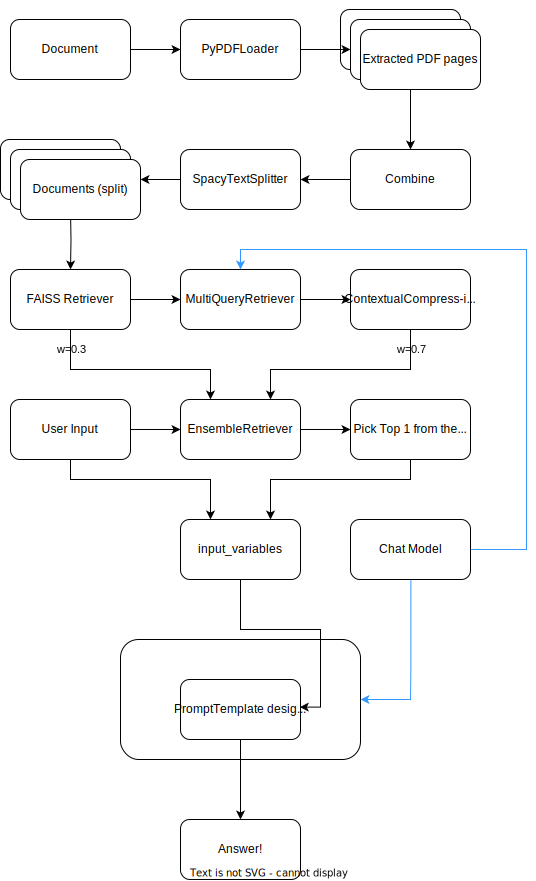

<p align="center">


</p>

# PDF Chatbot

Outlined in this document is a Chatbot that is able to open a PDF doc and answer the questions from a user.

---

## Getting Started

Use the following command to

- Install the required packages
- Export the relevant env variables to the memory

```commandline
sh init.sh
```

## Example

Show below is an example of how to use this Chatbot for searching a PDF document for information.

### Input

```commandline
python chatbot.py chapter6.pdf
```

### Output

```commandline
 🤖💬️ FileLoad|chapter6.pdf|Attempting
 🤖💬️ FileLoad|chapter6.pdf|Successful
 🤖💬️ TextSplitter|Instantiation|Start
 🤖💬️ TextSplitter|Instantiation|End
 🤖💬️ TextSplitter|split_documents|Start
 🤖💬️ TextSplitter|split_documents|End
 🤖💬️ ChatOpenAI|Model|loading|
 🤖💬️ ChatOpenAI|model|loaded|
 🤖💬️ Enter Your Query:
```

### Overview

Here is a video showing the above in action.

[](https://www.youtube.com/watch?v=u9sWso45cRw)

---

## Architecture

### Document Loader and TextSplitter

This Chatbot uses
the  [PyPDFLoader](https://api.python.langchain.com/en/latest/document_loaders/langchain.document_loaders.pdf.PyPDFLoader.html)
for loading the document. _By default, each of the page of the PDF is loaded into a separate document_. But there is an
inherent problem with this. Many a times, the context is spread across multiple pages. This is problematic for
retrieval.

**How to solve this?** To make sure that context is "together", the first step is to combine all the separate texts into
a single long text and later split that using a `TextSplitter` of our choice. This chatbot does that
using [SpacyTextSplitter](https://api.python.langchain.com/en/latest/text_splitter/langchain.text_splitter.SpacyTextSplitter.html)
. `SpacyTextSplitter` uses the `spaCy` framework for splitting and is able to _automatically detect the sentence
contexts_ for making the split decisions. Though we can specify the chunk length, it can vary depending on the context
length.

Config for splitter: A chunk size of `1024` with an overlap of `256` was used.

### Prompt Template

A simple prompt that tells the Chatbot to only answer based on the context provided. This is to reduce the occurrences
of hallucinations.

```text
"""Answer the following question based on the context only and nothing else. 
                            if the user is asking for instructions, return the answer as bullets
                            context: {context}
                            question: {user_input}
                            answer: """
```

### Embeddings

Used [OpenAIEmbeddings](https://api.python.langchain.com/en/latest/embeddings/langchain.embeddings.openai.OpenAIEmbeddings.html)
for this use case.

ℹ️ Experiments with a
few [HuggingFaceEmbeddings](https://api.python.langchain.com/en/latest/embeddings/langchain.embeddings.huggingface.HuggingFaceEmbeddings.html)
resulted in performance was not as expected. Sometimes, there was
misinterpretation of the context for the given question. Sometimes, the retrieval was also nonsensical. Some
models used were [all-MiniLM-L6-v2](https://huggingface.co/sentence-transformers/all-MiniLM-L6-v2)
and [dslim/bert-base-NER](https://huggingface.co/dslim/bert-base-NER)

### Retriever(s)

To be able to get the most expected reponse possible, I have combined several concepts to design a
custom [EnsembleRetriever](https://python.langchain.com/docs/modules/data_connection/retrievers/ensemble). Explained
below is the methodology.

1. Create a [FAISS](https://faiss.ai/index.html) vectorstore and use the `as_retriever` method to turn it into a
   retriever.
2. Create
   a [MultiQueryRetriever](https://python.langchain.com/docs/modules/data_connection/retrievers/MultiQueryRetriever)
   to **augment** the user's question for better contextual search. Use the link for details on this concept.
3. Create
   a [ContextualCompressionRetriever](https://python.langchain.com/docs/modules/data_connection/retrievers/contextual_compression/)
   retriever for using the correct context from the extracted chunk for prompting the LLM
4. Finally, use the `ContextualCompressionRetriever`, `FAISS.as_retriever` and the `MultiQueryRetriever` to assemble
   the `EnsembleRetriever`
5. ℹ️ Abandoned the `BM25Retriever` after a few experiments, might integrate that back depending on the use case

### Chat Model

Used the [LLMChain](https://docs.langchain.com/docs/components/chains/llm-chain) for performing the chat operations.

### Bringing it all together!

The architecture for this bot is shown below

<p align="center">
  
</p>

### Full Interaction

```commandline
(venv) user % python chatbot.py chapter6.pdf
 🤖💬️ FileLoad|chapter6.pdf|Attempting
 🤖💬️ FileLoad|chapter6.pdf|Successful
 🤖💬️ TextSplitter|Instantiation|Start
 🤖💬️ TextSplitter|Instantiation|End
 🤖💬️ TextSplitter|split_documents|Start
 🤖💬️ TextSplitter|split_documents|End
 🤖💬️ ChatOpenAI|Model|loading|
 🤖💬️ ChatOpenAI|model|loaded|
 🤖💬️ Enter Your Query: what is the best way to use park and ride? 

- Park your vehicle in designated park and ride facilities
- Follow any posted signs indicating maximum parking duration (usually 48 hours)
- Coordinate with regional transit agencies, Public Transportation, and Regional Planning offices for any changes to park and ride facilities
- Ensure compliance with rest area parking regulations, including a maximum of eight hours within a twenty-four-hour period
- Do not camp or maintain a camp, tent, or other sleeping accommodation in rest areas within the limits of the right-of-way of highways
- Observe any designated parking time limits within rest areas
- Commercial vehicles can park up to an hour beyond the federally mandated rest period
- Consult engineering and traffic investigation for parking restrictions in ferry terminals and chain-up areas
- Do not use state parking facilities for sales of vehicles or other merchandise, as specified by RCW 46.55.070

Compressed Context: - Use turning movements to demonstrate ability. - Review and document bicycle lanes in the vicinity. - Park and Ride Lots: Within the department’s park and ride facilities, parking is limited to a maximum of 48 hours, when posted with signs (R8-1201). - Work closely with regional transit agencies, Public Transportation and Regional Planning offices when considering changes to Park and Ride facilities. - Rest Area Parking: Rest Area parking is permitted by law RCW 47.38.020. Rest Area parking is limited to eight hours within a twenty-four-hour period. - No person shall camp maintain a camp, tent, or other sleeping accommodation in a Rest Area within the limits of the right-of-way of interstate highways or other state highways or in other areas of state or interstate highways as designated in RCW 47.12.250. - The department may designate zones within a Rest Area with shorter parking time limits for the purposes of maximum efficiency and safety. - Commercial Vehicles can park up to an hour beyond the federally mandated rest period. - Other Parking restrictions; Ferry Terminals, and Chain-Up Areas, conduct an engineering and traffic investigation of the location and document the condition. - Regulation of Sales within State Parking Facilities – The use of state parking facilities for sales of vehicles or other merchandise is not allowed and the supporting enforcement statutes are as follows: • RCW 46.55.070 specifies the posting requirements for public parking facilities.

Original Context: ⓘ From chapter6.pdf || Use turning movements to demonstrate ability. • Review and document bicycle lanes in the vicinity. Where it is necessary to initiate removing angle parking, it is important to partner with local agencies (for city streets that are also state highways) and/or the business community to establish a mutually acceptable time frame. In many locations, angle parking may be the only parking available to business patrons. In these cases, a comprehensive approach to providing other parking must be part of any effort to remove angle parking. Refer to the procedures for Rescinding Traffic Regulations below. Traffic Regulations Chapter 6WSDOT Traffic Manual M 51-02.10 Page 6-23 May 20217. Park and Ride Lots and Rest Area Parking Restrictions Park and Ride Lots: Within the department’s park and ride facilities, parking is limited to a maximum of 48 hours, when posted with signs (R8-1201). The State Traffic Engineer established this restriction through an official Calendar Agenda action on January 8, 1982. ( RCW 46.61.577 ) Local agency police can enforce parking regulations in WSDOT Park and Ride lots if the city or town has adopted an ordinance similar to the department’s 48 hour parking maximum. Work closely with regional transit agencies, Public Transportation and Regional Planning offices when considering changes to Park and Ride facilities. Included is a link to WSDOT’s Park and Ride locations statewide; Park and Ride . If modifications are necessary to the 48-hour ruling, submit a Calendar Agenda item to the State Traffic Engineer with the following supporting documentation: • Vicinity map showing SR/MP of Park and Ride Location. • Narrative describing the need for the parking restriction. • Local Agency ordinance if located outside the boundary of a limited access highway. • Documentation related to communication with Regional Planning Division, Public Transportation, local transit agency, law enforcement, regional maintenance, and local agency. 8. Rest Area Parking: Rest Area parking is permitted by law RCW 47.38.020 . Rest Area parking is limited to eight hours within a twenty-four-hour period. No person shall camp maintain a camp, tent, or other sleeping accommodation in a Rest Area within the limits of the right-of-way of interstate highways or other state highways or in other areas of state or interstate highways as designated in RCW 47.12.250 . The department may designate zones within a Rest Area with shorter parking time limits for the purposes of maximum efficiency and safety. Commercial Vehicles can park up to an hour beyond the federally mandated rest period. In most cases this is eleven hours. The department shall post the appropriate signage consistent with RCW 46.55.070(1) at all Rest Areas regarding the parking time limits in this section. If modifications are necessary outside of what is authorized, submit as a Calendar Agenda item to the State Traffic Engineer with the following supporting information: • Vicinity and strip map showing the SR/MP of the proposed parking regulation. • Narrative describing the need for parking restriction. • WSP concurrence. • Parking plan layouts. Chapter 6 Traffic RegulationsPage 6-24 WSDOT Traffic Manual M 51-02.10 May 20219. Other Parking restrictions; Ferry Terminals, and Chain-Up Areas , conduct an engineering and traffic investigation of the location and document the condition. Submit the proposed restriction as a Calendar Agenda item to the Regional Administrator together with copies of all correspondence associated with the request. 10. Regulation of Sales within State Parking Facilities – The use of state parking facilities for sales of vehicles or other merchandise is not allowed and the supporting enforcement statutes are as follows: • RCW 46.55.070 specifies the posting requirements for public parking facilities. 

 🤖💬️ Enter Your Query: exit
 🤖💬️ Thank you for using our Chat service. Have a great day!!
```

---

<p align="center">Fermibot ✌️</p>
